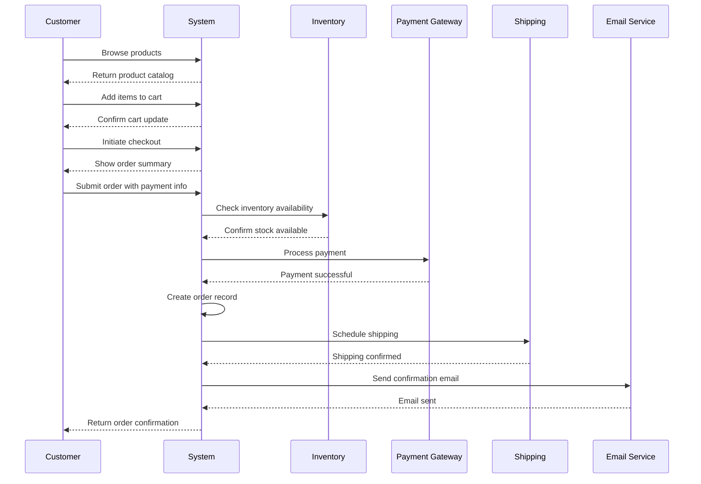
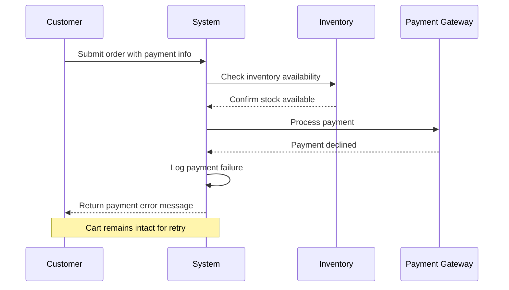
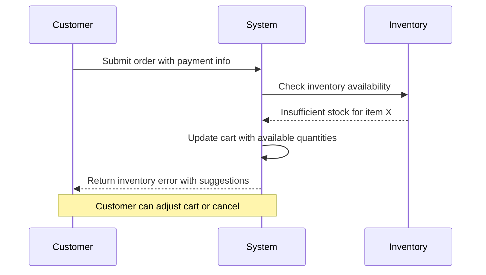
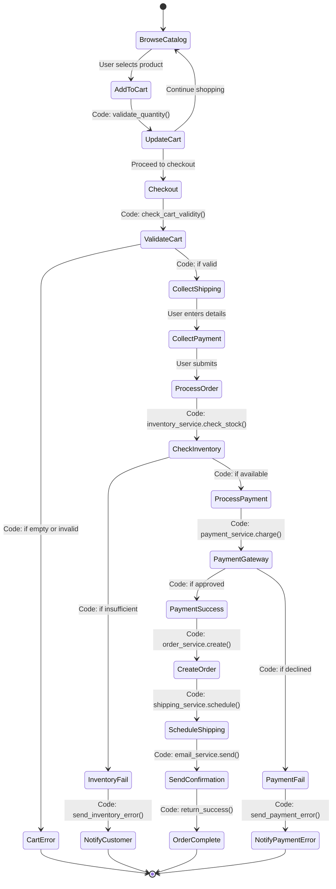
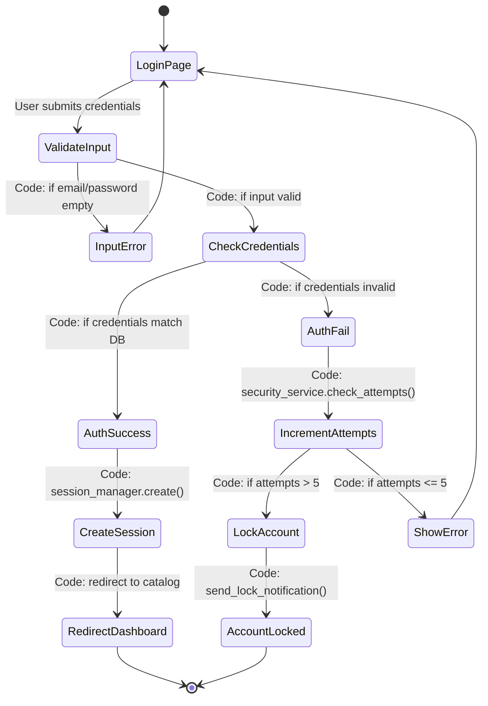

# UML Modeling

## System Sequence Diagrams

### Happy Path: Successful Order Placement

### Failure Path: Payment Declines

### Failure Path: Insufficient Inventory

## Activity Diagrams

### Order Placement Process with Code Decision Points

### User Authentication Flow

## Design Decisions

### Sequence Diagram Choices
- **System Boundary**: The "System" participant represents the Customer Ordering sub-system, encapsulating all internal components.
- **Happy Path**: Covers the complete successful flow from browsing to confirmation.
- **Failure Paths**: Include common failure scenarios (payment decline, inventory issues) to ensure robust error handling.
- **External Actors**: Payment Gateway, Inventory, Shipping, and Email are modeled as separate participants to highlight integration points.

### Activity Diagram Choices
- **Code Integration**: Decision points explicitly call out code methods (e.g., `validate_quantity()`, `check_stock()`) to show where business logic resides.
- **State Representation**: Uses states for user interactions and processes for system operations.
- **Error Handling**: Dedicated paths for different error conditions ensure comprehensive coverage.
- **Flow Control**: Guards on transitions represent conditional logic that will be implemented in code.

These diagrams provide visual specifications for implementation and testing, with code-level detail for developers.
